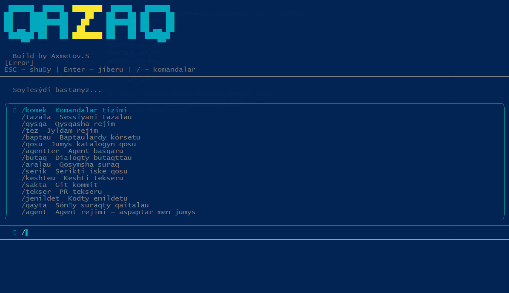

# Qazaq CLI

<p align="center">

</p>

[](https://www.npmjs.com/package/qazaq-cli)
[](https://opensource.org/licenses/MIT)
[](https://nodejs.org/)

**Qazaq CLI** — AI agent with TUI chat, web search, shell execution, file operations, and 15 slash commands. Built with Node.js, Ink (React terminal UI), and OpenAI-compatible APIs.

## Features

- **TUI Chat** — beautiful terminal interface with ASCII art header
- **AI Agent** — multi-step tool calling (search, fetch, shell, git, files)
- **Web Search** — DuckDuckGo search integration
- **Web Fetch** — read and extract content from any URL
- **Shell Execution** — run bash commands (build, test, deploy)
- **File Operations** — read, write, list, search files
- **Git Integration** — commit, push, pull, diff, branch
- **Package Management** — install packages (npm, pip, apt, brew)
- **15 Slash Commands** — Kazakh-language commands in TUI
- **10+ Providers** — OpenAI, OpenRouter, Groq, DeepSeek, Together, Mistral, xAI, Gemini, Ollama, Custom

## Installation

```bash
npm install -g qazaq-cli
```

## Quick Start

```bash
# Launch TUI chat (default)
qazaq

# Ask a question
qazaq ask "What is Node.js?"

# Run AI agent with tools
qazaq agent "Find the latest Node.js version and explain what's new"

# Interactive chat
qazaq chat

# File operations
qazaq read src/index.js
qazaq ls .
qazaq fix src/app.js
qazaq explain src/utils/
```

## Providers

| Provider | Env Key | Default Model |
|----------|---------|---------------|
| **OpenAI** | `OPENAI_API_KEY` | `gpt-4o-mini` |
| **OpenRouter** | `OPENROUTER_API_KEY` | `openai/gpt-4o-mini` |
| **Groq** | `GROQ_API_KEY` | `llama-3.3-70b-versatile` |
| **DeepSeek** | `DEEPSEEK_API_KEY` | `deepseek-chat` |
| **Together AI** | `TOGETHER_API_KEY` | `meta-llama/Llama-3.3-70B-Instruct-Turbo` |
| **Mistral** | `MISTRAL_API_KEY` | `mistral-large-latest` |
| **xAI Grok** | `XAI_API_KEY` | `grok-2-latest` |
| **Google Gemini** | `GEMINI_API_KEY` | `gemini-2.0-flash` |
| **Ollama (local)** | — | `llama3.1` |
| **Custom** | `QAZAQ_API_KEY` | — |

### Configuration

```bash
# Set provider
qazaq config --set provider=openai
qazaq config --set openai.apiKey=sk-...
qazaq config --set openai.model=gpt-4o

# Custom endpoint
qazaq config --set provider=custom
qazaq config --set custom.baseURL=https://your-endpoint/v1
qazaq config --set custom.apiKey=your-key
qazaq config --set custom.model=your-model

# View settings
qazaq config --list
```

## TUI Commands

Launch with `qazaq` (no args), then use slash commands:

| Command | Description |
|---------|-------------|
| `/komek` | Show all commands |
| `/tazala` | Clear session |
| `/qysqa` | Compact mode (short answers) |
| `/tez` | Fast mode |
| `/baptau` | View/change settings |
| `/qosu` | Add working directory |
| `/agentter` | Manage AI agents |
| `/butaq` | Branch conversation |
| `/aralau` | Side question |
| `/serik` | Companion mode |
| `/keshteu` | Session stats |
| `/sakta` | Git commit |
| `/tekser` | PR review |
| `/jenildet` | Simplify code |
| `/qayta` | Repeat last question |
| `/agent` | Agent tools info |

## AI Agent Tools

The agent has access to 10 tools:

| Tool | Description |
|------|-------------|
| `shell_exec` | Execute bash commands |
| `file_read` | Read file content |
| `file_write` | Write to files |
| `file_list` | List directory contents |
| `file_search` | Search in files (grep) |
| `git_exec` | Git operations |
| `web_fetch` | Fetch and read web pages |
| `web_search` | Search the internet |
| `download` | Download files |
| `install_package` | Install packages (npm, pip, apt, brew) |

## Agent Mode

The agent automatically decides which tools to use based on your request:

```bash
# CLI agent
qazaq agent "Read the package.json and tell me the dependencies"
qazaq agent "Search for Node.js 2026 news and summarize"
qazaq agent "Run npm test and fix any failures"
qazaq agent "Create a README.md for this project"

# TUI agent (just type your request)
qazaq
> What is the weather in Almaty today?
> Write a Python script that sorts a list
> Review the code in src/index.js
```

## Environment Variables

| Variable | Description |
|----------|-------------|
| `QAZAQ_PROVIDER` | Default provider (e.g. `openai`, `groq`, `deepseek`) |
| `QAZAQ_MODEL` | Default model name |
| `OPENAI_API_KEY` | API key for OpenAI |
| `OPENROUTER_API_KEY` | API key for OpenRouter |
| `GROQ_API_KEY` | API key for Groq |
| `DEEPSEEK_API_KEY` | API key for DeepSeek |
| `TOGETHER_API_KEY` | API key for Together AI |
| `MISTRAL_API_KEY` | API key for Mistral |
| `XAI_API_KEY` | API key for xAI |
| `GEMINI_API_KEY` | API key for Google Gemini |

## Project Structure

```
qazaq_cli/
├── bin/
│   └── index.js           # CLI entry point
├── src/
│   ├── agent/
│   │   ├── index.js       # Agent loop (tool calling)
│   │   └── tools.js       # Tool registry (10 tools)
│   ├── commands/
│   │   ├── agent.js       # CLI agent command
│   │   ├── ask.js         # Single question
│   │   ├── chat.js        # Interactive chat
│   │   ├── config.js      # Settings management
│   │   └── files.js       # File operations
│   ├── providers/
│   │   ├── registry.js    # Provider definitions
│   │   └── index.js       # Provider factory
│   ├── tui/
│   │   ├── App.js         # TUI chat interface (Ink/React)
│   │   ├── commands.js    # 15 slash commands
│   │   └── run.js         # TUI entry point
│   ├── utils/
│   │   ├── config.js      # Config persistence
│   │   ├── filesystem.js  # File operations
│   │   └── format.js      # Output formatting
│   └── index.js           # Commander.js CLI
├── package.json
└── README.md
```

## Tech Stack

- **Node.js** 18+ (ES Modules)
- **Commander.js** — CLI argument parsing
- **Ink** + **React** — terminal UI
- **OpenAI SDK** — all providers (OpenAI-compatible API)
- **Chalk** — terminal colors
- **Ora** — spinners
- **Inquirer** — interactive prompts

## Contributing

Contributions welcome! Please open an issue first for major changes.

1. Fork the repository
2. Create your branch (`git checkout -b feature/amazing`)
3. Commit changes (`git commit -m 'Add amazing feature'`)
4. Push to branch (`git push origin feature/amazing`)
5. Open a Pull Request

## License

MIT © [Axmetov.S](https://github.com/AXMETOV-KZ)

## Acknowledgments

- [OpenAI](https://openai.com) — API standard
- [OpenRouter](https://openrouter.ai) — multi-provider gateway
- [Groq](https://groq.com) — fast inference
